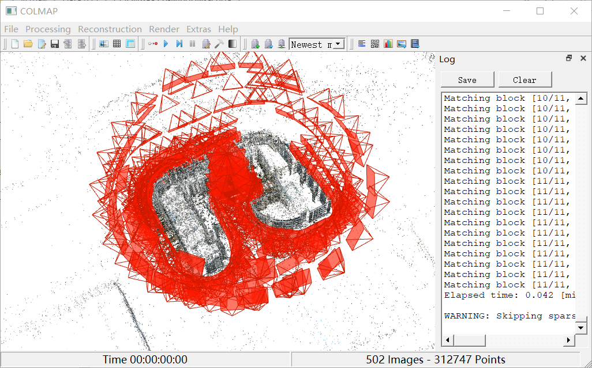
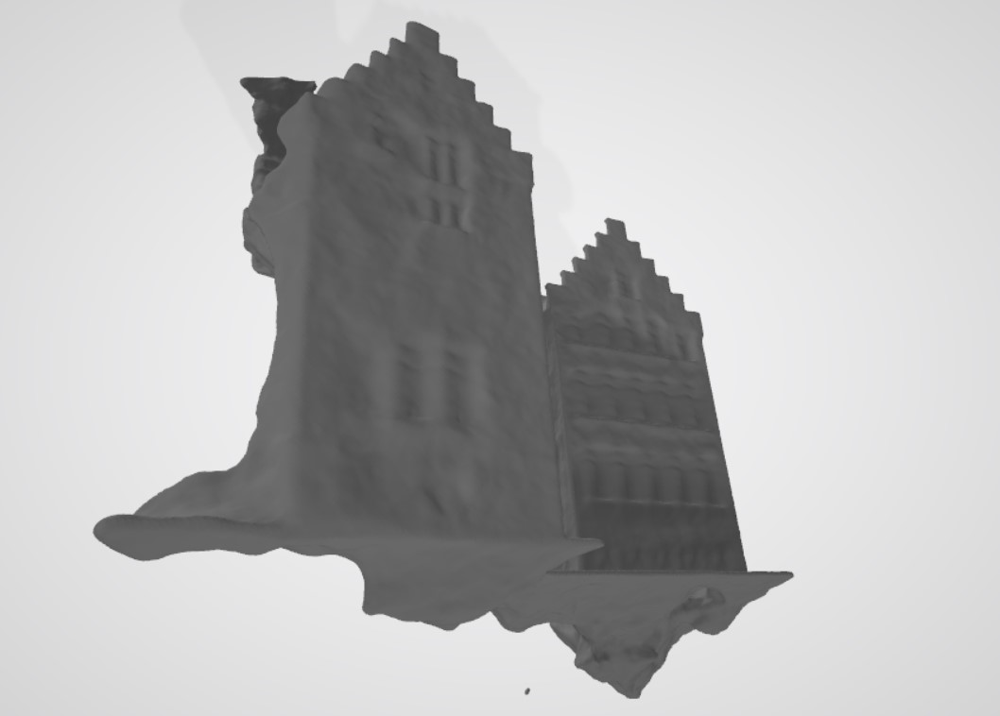

# NeuS

This is the Learning-based method that we used in our project. Although the reconstructed model was not used in our final presentation, the learning process was quite fruitful. The code is retrieved from [here](https://github.com/Totoro97/NeuS) with some modification.

### Reproduction

Here we summarize the main steps we took when doing this project. You can reproduce our result after these steps. If you just want to take a look at the result, you can follow the steps from the original [repo](https://github.com/Totoro97/NeuS), and the pretrained model is [here](https://pan.baidu.com/s/1xsPJp5CHSSnBAKRH0vB3ZA) (Code: wc14)

#### custom data

More information can be found in [preprocess_custom_data](https://github.com/Totoro97/NeuS/tree/main/preprocess_custom_data). Below is the way we used to generate out model.

##### Struct from Motion

Camera parameters are required to conduct NeuS. Please first download the open source software [COLMAP](https://github.com/colmap/colmap/releases/tag/3.6).

The workflow is as follow:

1. Open the COLMAP, then successively click `reconstruction`-`Automatic reconstruction` options.
2. Select your Workspace folder and Image folder.
3. (Optional) Unclick Dense model to accelerate the reconstruction procedure.
4. Click `Run`.
5. After the completion of reconstruction, you should be able to see the result of sparse reconstruction as well as position of cameras.(Fig )
6. Click `File` - `Export model as text`. There should be a `camera.txt` in the output folder, each line represent a photo. In case there are photos that remain mismatched, you should dele these photos and rematch. Repeat this process until all the photos are mathced.
7. Move the there txts to the `sparse` folder.



##### process data

Neus need `camera_sphere.npz` and mask data. 

1. To generate `camera_sphere.npz`, you need to change `DIR` in `scripts/colmap2npz.py` to the previously generated colmap data. Then run `python scripts/colmap2npz.py`.
2. To generate mask data, you need to change `path` in `scripts/mask_gen.py`to the previously generated colmap data folder. Then run `python scripts/mask_gen.py`. Note that here we set every pixel in the picture to be 255, if you want better result, you can manually mask the pictures one by one.

The data is organized as follows:

```
<case_name>
|-- cameras_xxx.npz    # camera parameters
|-- image
    |-- 000.png        # target image for each view
    |-- 001.png
    ...
|-- mask
    |-- 000.png        # target mask each view (For unmasked setting, set all pixels as 255)
    |-- 001.png
    ...
```

##### Running

```
# note that data generate above is unmasked
python exp_runner.py --mode train --conf ./confs/womask.conf --case <case_name>
```

To train with mask or extract surface from trained model, please refer to the original [repo](https://github.com/Totoro97/NeuS).

### Results

The reconstructed model is in `ply` format. You can visualize the model with [Meshlab](https://www.meshlab.net/) or [CloudCompare](https://www.danielgm.net/cc/) .



